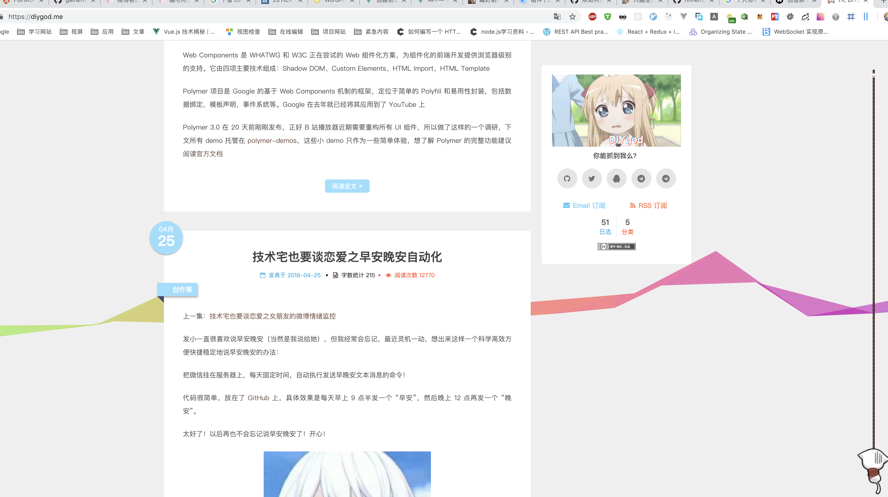
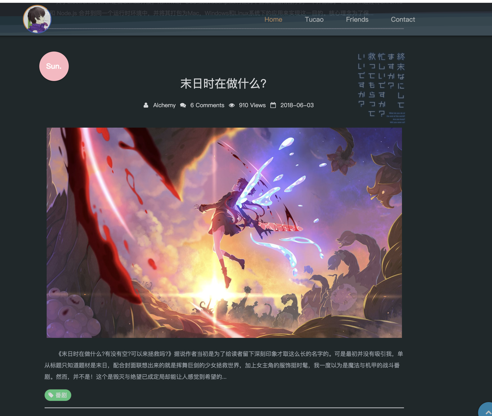

## MyBlog

blog 是使用 Node.js + MongoDB + 其它客户端框架开发的个人博客系统,前后端分离,仿简书模板.

服务端有: express 版 , koa 版, egg.js

客户端有: react 版 , vue 版， vue3.0， nuxt.js

移动端有: react native 版, ionic2.0 版

UI: iview

ps: 博客就是用来检验所学知识的产物

一些灵感： animation gameful 音乐播放 视屏播放

https://diygod.me/

https://www.fghrsh.net/post/123.html

https://www.coolecho.net/

头部固定 分类标签首页 关于 搜索

侧边栏 音乐 游戏 3d 游览

右下角 添加博客 草稿箱等功能

page 组件 总共有 xx 条 你还有 xx 条未读

pvuv

评论

文件上传

todolist

自己写的工具

gitbooks

live2d

管理员可登陆 可修改删除新增帖子 评论删除等

静态博客-> 动态博客 -> 音乐 视屏 评论 live2d 等组件 -> 优化 -> 3d 游览
